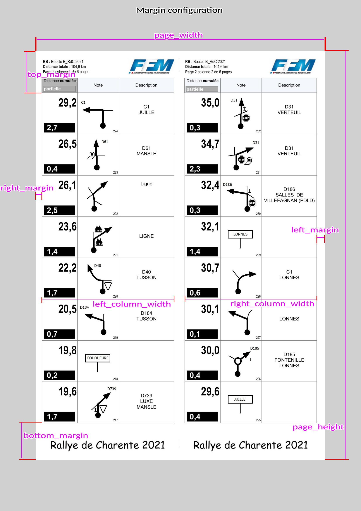

# FFM Roadbook Rallye Converter for digital roadbook

This script convert pdf roadbook to a set of image where each image correspond to a roadbook case.
This python script is made under a Poetry environement.

## Setup environment
This python project requier Python 3.10 and Poetry 1.1.13 (environment manager, good stuff).
See how to install both of them depending your OS :
- https://www.python.org/downloads/
- https://python-poetry.org/docs/

### Install Poppler
*pdf2image* needs to have *poppler*, see here https://pypi.org/project/pdf2image/ how to get *poppler* depending your OS.
##### For windows :
Unzip poppler in this directory and update the **POPPLER_PATH** in *convert_roadbook.py* if needed.
By default, the **POPPLER_PATH** is set to *"poppler-22.01.0/Library/bin"*. So if you use the same version, just unzip poppler in this directory.
##### For linux :
Set the **POPPLER_PATH** to None in *convert_roadbook.py*.

### Initialise poetry environment
After installing poppler, initiate the environment, run : 
```
poetry install
```
Poetry will setup all remainging needed dependencies.

## Run the script
Run the helper :
```
poetry run python convert_roadbook.py -h
usage: convert_roadbook.py [-h] [-o OUTDIR] [-c CONF] N [N ...]

Convert FFM pdf roadbook to image, 1 image per case.

positional arguments:
  N                     files to convert

options:
  -h, --help            show this help message and exit
  -o OUTDIR, --outdir OUTDIR
                        output directory where image will be stored
  -c CONF, --conf CONF  page configuration
```

Convert a pdf roadbook :
```
poetry run python convert_roadbook.py a_roadbook.pdf
```
It will generate a new directory by the name of the roadbook that will contain each images case.

#### Running options
- -o / --outdir : to specify an output directory where images should be stored
- -c / --conf : to specify an other page margin configuration file that the default one (*page_config.toml*)

#### Page margin configuration
Depending of the format using to create the pdf roadbook, the margin configuration could be updated by creating a new configuration file and setting it in the script options (or by editing the default one).

The default configuration file *page_config.toml* contains this :
```
[DEFAULT]
bottom_to_top = yes
use_cm = no
case_per_column = 8

[PXL]
left_margin = 34
right_margin = 46
left_column_width = 756
right_column_width = 756
top_margin = 238
bottom_margin = 209

[CM_A4]
left_margin = 0.4
right_margin = 0.6
left_column_width = 9.4
right_column_width = 9.4
top_margin = 3
bottom_margin = 2.7
```

Convert a pdf roadbook with a specific page configuration :
```
poetry run python convert_roadbook.py -c my_page_config. toml a_roadbook.pdf
```

###### The DEFAULT section
The default section define the direction of the case reading (bottom to top or top to bottom), the margin type you want to use (pixel or centimeter) and the number of case per column.
- *bottom_to_top* : yes / no, yes read bottom to top, no read top to bottom
- *use_cm* : yes / no, yes will use the margin define in the **CM_A4** section, no will use the **PXL** section margin.
- case_per_column : interger, the number of case per column

###### The PXL section
If the *use_cm* option is set to *no*, it will use the margin define in this section.
The margin are define in pixel (so all values must be interger).
To help you to mesure it with you favorite image editor, you can run the script with default configuration, the will always save the first page in add of the cases for reference.

###### The CM_A4 section
If the *use_cm* option is set to *yes*, it will use the margin define in this section.
The margin are define in centimeter (so all values must be float) based on the situation where the roadbook is edited in A4 format (21x29,7cm).
To help you to mesure the margin, you can simply print one page of the raodbook and mesure the margin with a rule (or use your favorite image editor configured to use centimeter unit).

###### The margins
The following picture will show you each margin needed to be defined in the configuration.

